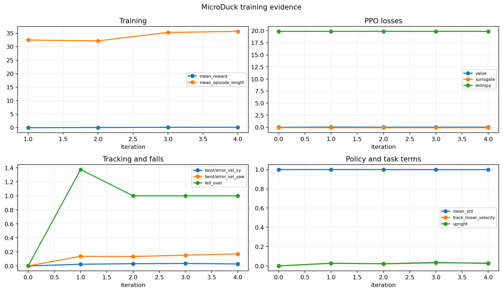
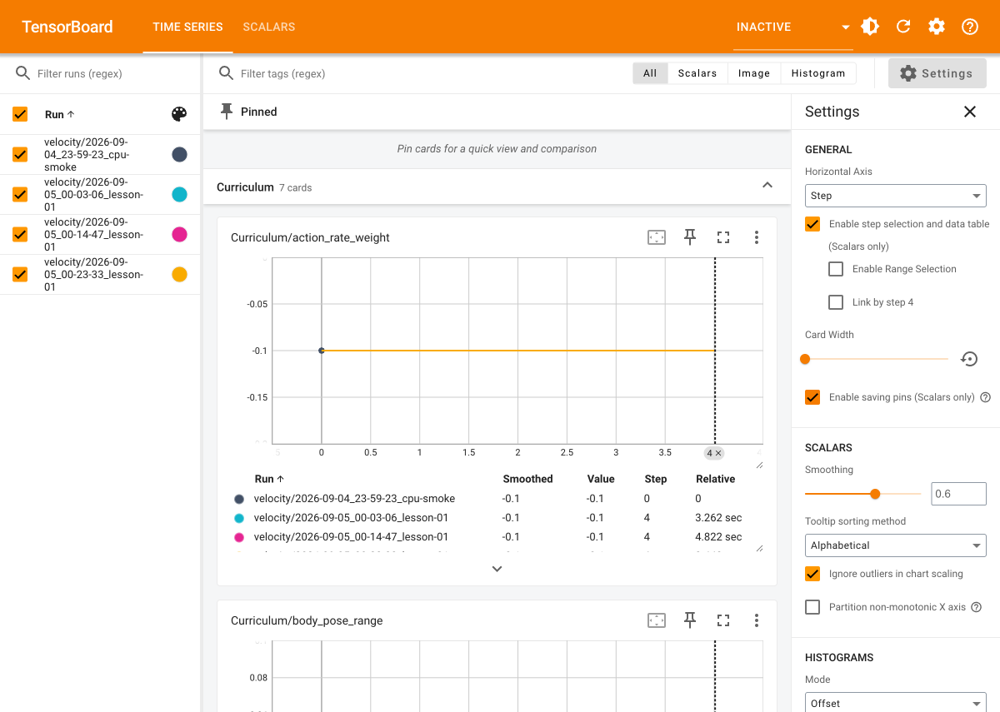

# 5 次迭代，能证明强化学习环境可用吗？

这是《从零复刻一只会走路的小鸭子》的第 1 篇。

## 先说结论

5 次迭代不能证明小鸭子学会了走路，但可以证明训练链路基本打通：环境能创建，PPO 能更新，TensorBoard 能写日志，checkpoint 能保存，策略能导出成 ONNX。

这两个结论必须分开。否则看到 reward 从负数变成正数，就很容易误以为机器人已经学会了走路。

## 我运行了什么

本次使用 `Mjlab-Velocity-Flat-MicroDuck`，8 个并行环境，每个环境每次收集 24 步，总共运行 5 次迭代。总采样量是：

```text
8 × 24 × 5 = 960 transitions
```

每个环境只经历了大约 2.4 秒的仿真时间，因此这更接近“启动自检”，而不是训练。

```bash
uv run train Mjlab-Velocity-Flat-MicroDuck \
  --gpu-ids None \
  --env.scene.num-envs 8 \
  --agent.num-steps-per-env 24 \
  --agent.max-iterations 5 \
  --agent.logger tensorboard \
  --agent.upload-model False \
  --agent.run-name lesson-01
```

## TensorBoard 曲线怎么读





`Train/mean_reward` 从 `-0.0614` 上升到 `0.0950`。这是积极信号，说明网络确实在得到更新，但它不是充分条件。

我还看到 `Episode_Termination/fell_over` 仍然接近 `1.0`，而 `Metrics/twist/error_vel_yaw` 从 `0.1374` 增加到 `0.1716`。这说明策略仍然经常摔倒，转向也没有变好。

`Policy/mean_std` 基本保持在 `1.0`，说明探索没有快速塌缩。`Loss/value` 在不同迭代之间波动，也不能简单要求它单调下降。

所以本次正确的结论是：

> 训练和导出流程通过；步态学习尚未开始到可以评价的程度。

## ONNX 结果

导出的策略接口是：

```text
obs     [1, 61]
actions [1, 14]
```

这和 MicroDuck runtime 的 observation/action 合同一致。ONNX Runtime 可以用全零输入完成推理，输出没有 NaN。

但“模型可以推理”不等于“模型可以控制真实机器人”。真机还需要正确构造 IMU、关节位置、关节速度、上一次 action 和命令输入，并应用安全限幅。

## 下一步

下一次我会把环境数量提高到 64，把迭代提高到 50 或 100，再观察：

1. episode length 是否持续增加；
2. `fell_over` 是否下降；
3. 速度误差是否下降；
4. reward 增长是不是来自真正的 tracking，而不是某个 penalty 的意外符号。

代码、日志和原始实验记录会一并保存，这样每一个结论都能重新运行。
